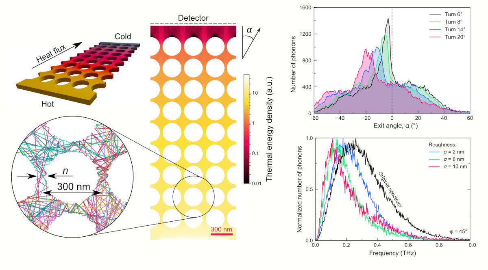

# FreePATHS

Monte Carlo algorithm that simulates trajectories of phonons in 3D models of nanostructures containing holes or pillars of various shapes. The algorithm outputs phonon trajectories, heat fluxes, temperature maps and profiles, the thermal conductivity, scattering maps, and other information.

<figure><figcaption>
Examples of FreePATHS outputs
</figcaption></figure>

### Repositories

* FreePATHS - [https://github.com/anufrievroman/freepaths](https://github.com/anufrievroman/freepaths)
* Documentation - [https://github.com/anufrievroman/freepaths-docs](https://github.com/anufrievroman/freepaths-docs)
