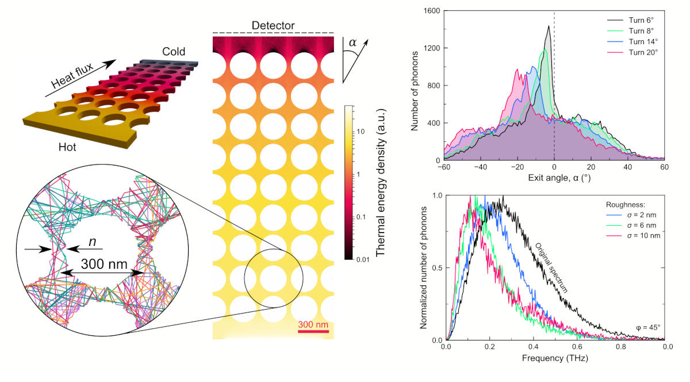

# FreePATHS

FreePATHS is a Monte Carlo simulator that traces phonon and electron trajectories in 3D models of nanostructures containing holes, pillars, interfaces, and material inclusions of arbitrary shape. For phonons, the algorithm outputs trajectories, heat fluxes, temperature maps and profiles, thermal conductivity (via the Fourier law or mean free path sampling), scattering maps, and other information. For electrons, it computes the electrical conductivity, Seebeck coefficient, and electronic thermal conductivity, so that thermoelectric properties (including the figure of merit ZT) can be predicted for the same geometry.

<figure><figcaption>
Examples of FreePATHS outputs
</figcaption></figure>

### Repositories

* FreePATHS - [https://github.com/anufrievroman/freepaths](https://github.com/anufrievroman/freepaths)
* Documentation - [https://github.com/anufrievroman/freepaths-docs](https://github.com/anufrievroman/freepaths-docs)
