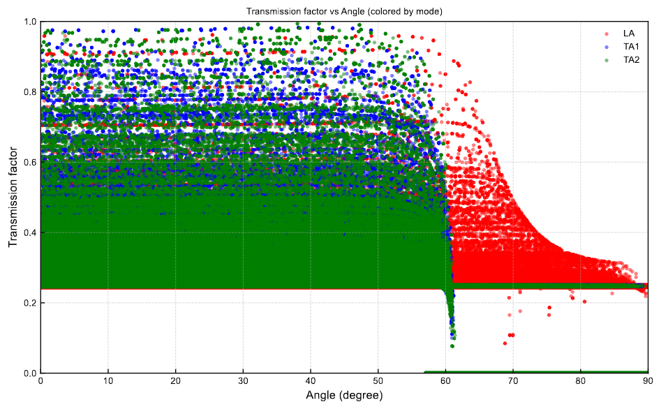

# Phononic crystal

This example shows how to add layers in a specific material to your structure and can be reproduced with `examples/layers.py` input file. The structure contains the square array of layer defined in the input file as:

```
# Materials: Si (bulk) et Ge (material layers) 
from freepaths.materials import Si, Ge #import yout materials here

MATERIALS = [Si(temp=T), Ge(temp=T)] # put all the materials you want to use in this list

#-----if you devide the length by the period you must habe an integer number of interfaces-----#
INTERFACES = []
period = 30e-9 # modify this value to change the distance between two interfaces
start_x = -WIDTH / 2 + period
end_x = WIDTH / 2 - period
INTERFACE_ROUGHNESS = 1.5e-9  # roughness of the interfaces

x = start_x
while x <= end_x:
    INTERFACES.append(VerticalPlane(position_x=x, roughness=INTERFACE_ROUGHNESS, material=Ge(temp=T), depth = THICKNESS)) # add the material of the layers here
    x += period
```

Here, the `INTERFACE` list is filled with the `VerticalPlane` objects. This will create a structure that looks like so:

<figure><figcaption><p>Phonon trajectories.</p></figcaption></figure>

If we increase the number of phonons to several thousand, we can see some interesting curves. For examples, the transmission factor in function of the incident angles. 

<figure><figcaption><p>Angular distribution show of phonons on hot and cold sides.</p></figcaption></figure>

One can also output, for example, phonon frequency spectrum or time phonons took to reach the cold side.

<div><figure><figcaption><p>Phonon frequency spectrum.</p></figcaption></figure> <figure><figcaption><p>Time that phonons took to reach the cold side.</p></figcaption></figure></div>

The file `information.txt` also contains various statistical insides, for example, the scattering likelihood:

```
95% of particles reached the cold side

8.62% - scattering on side walls (99.88% - diffuse, 0.12% - specular)
1.60% - scattering on top and bottom walls (90.00% - diffuse, 10.00% - specular)
0.78% - rethermalization at the hot side
71.27% - internal scattering processes
18.33% - scattering on interfaces (24.08% - diffuse, 75.92% - specular)
67.81% - transmission through interfaces (24.72% - diffuse, 75.28% - specular)
```

### References

1. Singh et al. [Applied Physics Letters, (2023)](https://aip.scitation.org/doi/10.1063/5.0137221)
2. Anufriev et al. [Materials Today Physics 15, 100272 (2021)](https://www.sciencedirect.com/science/article/pii/S2542529320300961)

