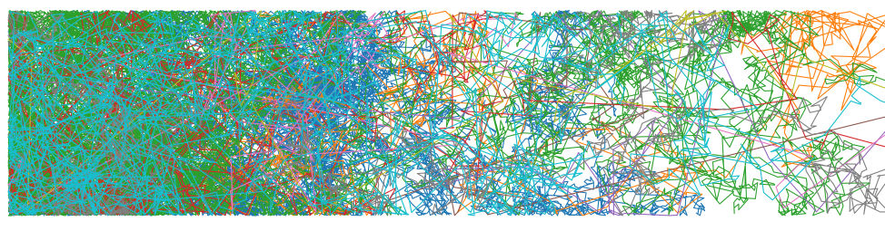

# Nanowire

The example `examples/nanowire.py` shows thermal transport simulation in a simple nanowire at room temperature. Here is an example of phonon paths in such a structure showing mostly diffusive behavior:

<figure><figcaption>
Example of phonon paths in the structure.
</figcaption></figure>

The algorithm calculates the thermal profiles, heat flux, and the thermal conductivity at different time intervals. From the profile plots, we can see how the temperature and heat flux profiles converge after about 6th timeframe, as the system is reaching the state:

<figure><figcaption>
Temperature profiles at different time instervals converge to the linear profile.
</figcaption></figure>

<figure><figcaption>
Heat flux profiles converge to the flat line.
</figcaption></figure>

This can be used to estimate the [thermal conductivity](../theory/themal-conductivity-calculation.md) of the structure. The  plot of thermal conductivity shows us the convergence and the averaging:

<figure><figcaption>
Thermal conductivity convergance and averaging over the steady state period.
</figcaption></figure>

For a simple nanowire, the material and effective thermal conductivities are identical and equal to about 54 W/m·K, which is consistent with experimental observations.

## Useful tips for thermal conductivity calculations

* The software can currently only calculate the thermal conductivity in the y direction. Also, make sure that the phonons are generated on the very side of the simulation.
* The software does not give correct results if pillars are present in the simulation.
* Because the calculation relies on the pixel grid to calculate the profiles, make sure that it is small enough and looks good (some discontinuities in the pixels adjacent to holes are expected and correct).
* Make sure that you simulate enough phonons (> 5000) to get valid results.
* Make sure that [time parameters](../getting-started/config-file-creation-guide.md#simulation-time-parameters) are set correctly.
