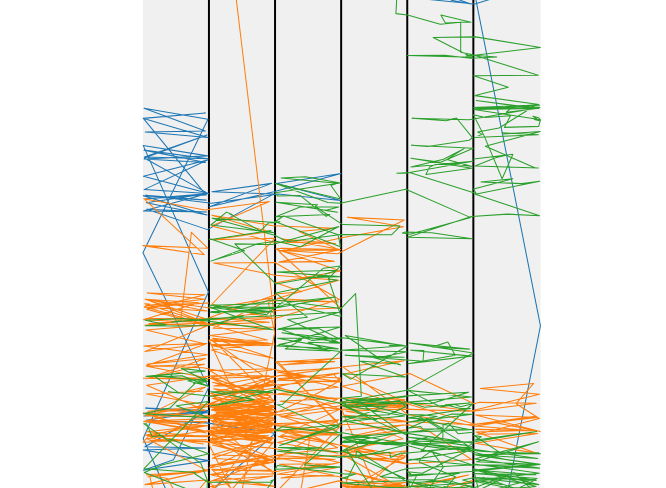
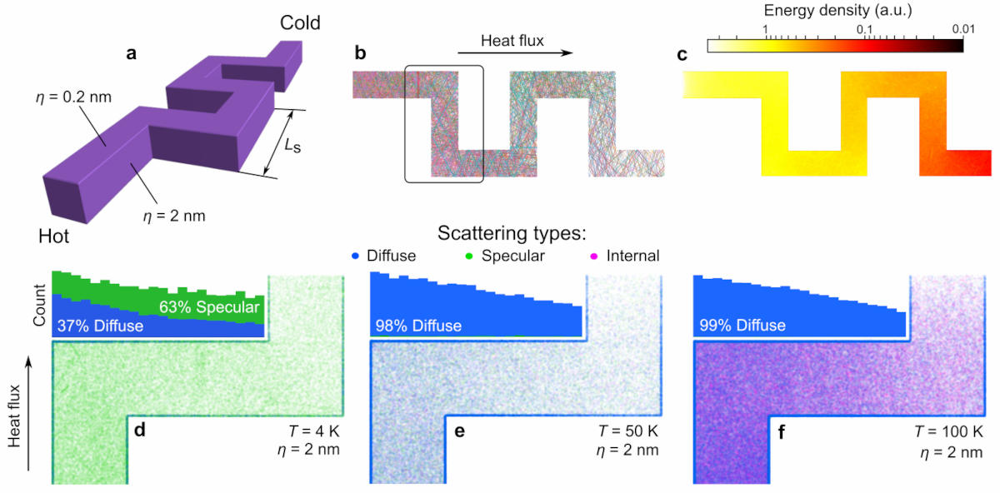

# Scattering map

In `examples/scattering_map.py` we learn how to output the map of scattering processes. Let us set the parameters suitable for this demonstration and switch on the scattering map:

```
OUTPUT_FOLDER_NAME             = 'Scattering map in fishbone nanowire'
NUMBER_OF_PHONONS              = 300
T                              = 50.0
OUTPUT_SCATTERING_MAP          = True

SIDE_WALL_ROUGHNESS            = 2e-9
HOLE_ROUGHNESS                 = 2e-9
TOP_ROUGHNESS                  = 0.2e-9
BOTTOM_ROUGHNESS               = 0.2e-9
```

Note that it's to run for a limited number of phonons because otherwise the scattering will become huge and difficult to open. Below it the example of obtained scattering map.

<figure><figcaption><p>Illustrations of phonon trajectories and coordinated of scattering events.</p></figcaption></figure>

We can observe side walls mostly experience diffuse scattering, while top and bottom walls show mainly specular scattering because of the roughness we set above.

A more detailed example below from Ref. 1 shows how the scattering maps evolve as the temperature is increased. Specifically, we can see how lots of specular scattering events are present at 4 K, but at higher temperatures diffuse scattering becomes dominant at 50 K, and at 100 K internal scattering event become the visible as well.

<figure><figcaption><p>Another example of phonon scattering maps.</p></figcaption></figure>

### Reference

1. Anufriev _et al_. [Nanoscale, 11, 13407-13414 (2019)](https://pubs.rsc.org/en/content/articlehtml/2019/nr/c9nr03863a)
