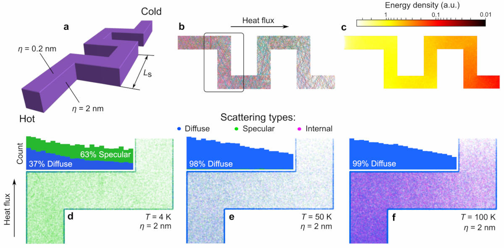

# Algorithm

The algorithm runs the simulations step-by-step and phonon-by-phonon. For each phonon, the algorithm calculates a trajectory, with a time step _dt_ and for as many time steps as required for the phonon to reach the cold side or until a maximum number of time steps is reached.

<figure><figcaption>
Scheme of the simulated system, indicating some of the parameters set in the input files.
</figcaption></figure>

### Initialization

At the beginning of time, each phonon is generated at the hot side. Each phonon is assigned a branch and frequency from the real phonon dispersion of the material. The sampling weights the density of states by the mode heat capacity and group velocity — this is the correct emission spectrum for a flux source (a hot wall emits each mode at a rate proportional to how fast that mode carries energy away). From the assigned frequency, the group velocity is read directly from the tabulated dispersion. The legacy Debye-Planck sampling (uniform branch selection, branch-blind Planck distribution) is still available via `SAMPLE_FROM_DISPERSION = False` but is not recommended.

The phonon starts moving step-by-step in the assigned direction according to the following equations:

$$
\begin{aligned}
\Delta x &= \sin(\theta)\cdot|\cos(\phi)|\cdot v\cdot dt \\
\Delta y &= \cos(\theta)\cdot|\cos(\phi)|\cdot v\cdot dt \\
\Delta z &= \sin(\phi)\cdot v\cdot dt
\end{aligned}
$$

where θ is the angle between the projection to _x-y_ plane and _y_-axis, and φ is the angle to the horizontal plane, _v_ is the speed, and _dt_ is the time step.

### Scattering on boundaries

At each time step _dt_, the algorithm checks if phonon crossed any of the boundaries. The boundaries include the top and bottom of the simulation, left and right walls, or walls of the holes or pillars. If the boundary is crossed, the corresponding function calculates at which angle _a_ phonon hits the boundary. Then, the algorithm calculates the specular scattering probability, determined by Soffer's equation:

$$
p = exp(-16 \pi ^2 \sigma^2 cos^2(\alpha) / \lambda ^2)
$$

where _p_ is the specularity probability (number between zero and one), σ is the surface roughness, α is the angle to the surface, and λ is the wavelength of the phonon. Then the algorithm draws a random number between zero and one. If the number is greater than p, then the scattering is diffuse, otherwise specular. If the scattering is specular, the phonon is reflected elastically, from the surface. If the scattering is diffuse, the phonon is reflected in a random direction, but using the [Lambert cosine distribution](https://en.wikipedia.org/wiki/Lambert's\_cosine\_law) of probability. After the scattering, the phonon continues the movement and keeps moving and being scattered until it either reaches the cold side, or returns to the hot side, or the time of the simulation for each phonon is over.

### Internal scattering

Besides the surface scattering, phonons experience internal scattering from phonon-phonon interactions (Umklapp and 4-phonon processes) and from point defects or mass-disorder impurities. The time between internal scattering events is drawn from an exponential distribution with rate equal to the sum of all individual scattering rates (Matthiessen's rule), and the relaxation time depends on frequency, temperature, and polarization.

At each internal scattering event, the event is attributed to one of two physical channels based on the ratio of their rates:

- **Inelastic channel** (Umklapp, 4-phonon): anharmonic processes that exchange energy with the phonon bath. The phonon's branch and frequency are redrawn from the dispersion-weighted distribution, proportional to the mode heat capacity divided by the inelastic relaxation time. This rethermalization step is essential for correct thermal transport: without it, energy deposited into slow zone-edge modes cannot return to faster modes and thermal conductivity is strongly underestimated.
- **Elastic channel** (impurity/mass-disorder, Rayleigh ∝ ω⁴): redirects the phonon without changing its frequency or branch. No rethermalization occurs.

The total scattering rate and the thermal conductivity are unaffected by this split; only the attribution of rethermalization events changes.

### Distributions and statistics

Once the simulation is over for a given phonon, the algorithm collects all the phonon properties (frequency, speed, path etc.), its entrance and exit angles, and other results and stores it in files. Then, the process repeats for the required number of phonons. After simulations for all phonons are done, the algorithm calculates various distributions and statistical facts about the simulation. For example, it calculates phonon spectrum at the beginning, phonon trajectories, phonon exit angle distribution, group velocities etc. The examples of the distribution are shown above in the picture. Then, it outputs all this information into the graphs and into .csv files. Examples below show scattering maps and statistics obtained using the Monte Carlo code for a [serpentine nanowire](https://pubs.rsc.org/en/content/articlelanding/2019/NR/C9NR03863A).

<figure><figcaption>
Examples of scattering maps and various distributions.
</figcaption></figure>
